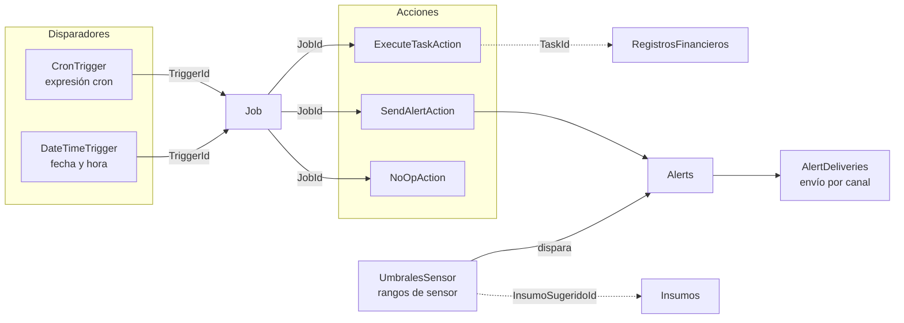

# AgroEco

Sistema de monitoreo y gestión agrícola que funciona **100% sin conexión a internet**, diseñado para productores en zonas rurales de Nicaragua. Conecta sensores, tareas, inventario y finanzas en un solo sistema — no son módulos sueltos, es un ecosistema.

## El problema

En Nicaragua, un mismo productor suele cuidar varias fincas sin poder visitarlas todos los días. Cuando una plaga o un problema de agua se detecta a simple vista, el daño ya está hecho. La mayoría de soluciones tecnológicas asumen internet constante y usuarios con experiencia técnica — condiciones que no existen en el campo real.

## Qué nos diferencia

- **Funciona sin internet.** No es una app que "se degrada" sin señal — está diseñada desde cero para operar 100% offline, porque la conectividad en las parcelas nunca es confiable.
- **Un ecosistema conectado, no módulos sueltos.** Cuando un sensor detecta una condición fuera de rango, el sistema genera automáticamente la tarea correspondiente. Al completarla, descuenta el insumo usado del inventario y registra el gasto real en finanzas — sin que el productor tenga que anotar nada por separado.
- **Diseñado para el productor real**, no para el usuario ideal de una app de oficina: interfaz simple, sin jerga técnica, pensada para alguien sin experiencia previa con sistemas agrícolas.

## Descripción

AgroEco recopila datos del campo mediante sensores de hardware conectados a dispositivos Arduino, los interpreta de acuerdo con el estado del cultivo, y notifica al usuario cuando existe algo que requiere su atención. A partir de esas alertas, genera automáticamente las tareas, descuenta insumos y registra gastos — todo desde una sola plataforma, con reportes automáticos que facilitan la lectura de la información recopilada.

## Vista previa

*(capturas de pantalla de la interfaz — dashboard, gestor de tareas ,sensores)*
# *Login*


# *Selector de Fincas*


# *DashBoard*


# *Modulo de tareas*


# *Modulo sensores*


---
## 1. Diagrama de base de datos

```mermaid
erDiagram
    Jobs ||--o{ Actions : "JobId"
    Jobs }|--|| Triggers : "TriggerId (CASCADE)"
    Triggers ||--|| CronTrigger : "1:1 (TPT)"
    Triggers ||--|| DateTimeTrigger : "1:1 (TPT)"
    Actions ||--|| ExecuteTaskAction : "1:1 (TPH)"
    Actions ||--|| SendAlertAction : "1:1 (TPH)"
    Actions ||--|| NoOpAction : "1:1 (TPH)"
    Alerts ||--o{ AlertDeliveries : "AlertId"
 
    Jobs {
        INTEGER Id PK
        string Name "VARCHAR(100), NOT NULL"
        string Description "VARCHAR(500)"
        string Status "VARCHAR(50), NOT NULL"
        INTEGER Priority
        DATETIME Date
        INTEGER TriggerId FK "NOT NULL"
    }
 
    Actions {
        INTEGER Id PK
        INTEGER JobId FK "NOT NULL"
        string Name "VARCHAR(100), NOT NULL"
        string ActionType "VARCHAR(13), DISCRIMINATOR"
        string Status "VARCHAR(50), NOT NULL"
        TEXT ExecuteTaskConfig
        TEXT SendAlertConfig
    }
 
    ExecuteTaskAction {
        INTEGER Id "PK, FK"
        TEXT ExecuteTaskConfig "NOT NULL"
    }
 
    SendAlertAction {
        INTEGER Id "PK, FK"
        TEXT SendAlertConfig "NOT NULL"
    }
 
    NoOpAction {
        INTEGER Id "PK, FK"
    }
 
    Triggers {
        INTEGER Id PK
        string Name "VARCHAR(100)"
    }
 
    CronTrigger {
        INTEGER Id "PK, FK"
        string CronExpression "VARCHAR(100), NOT NULL"
        string TimeZone "VARCHAR(50)"
        DATE StartDate
        DATE EndDate
    }
 
    DateTimeTrigger {
        INTEGER Id "PK, FK"
        DATETIMEOFFSET TargetTime "NOT NULL"
        BOOLEAN IsActive "NOT NULL"
    }
 
    Insumos {
        INTEGER Id PK
        string Nombre "VARCHAR(100), NOT NULL"
        string Categoria "VARCHAR(50)"
        string Cultivo "VARCHAR(50)"
        DECIMAL Cantidad "DECIMAL(18,2), NOT NULL"
        string Unidad "VARCHAR(20), NOT NULL"
        DECIMAL StockMin "DECIMAL(18,2), NOT NULL"
        string Finca "VARCHAR(50), NOT NULL"
        string Descripcion "VARCHAR(500)"
        DATE FechaCreacion "NOT NULL"
        DATE FechaActualizacion
        DATE Caducidad
    }
 
    RegistrosFinancieros {
        INTEGER Id PK
        string Tipo "VARCHAR(20), NOT NULL"
        string Categoria "VARCHAR(50), NOT NULL"
        string Cultivo "VARCHAR(50)"
        DECIMAL Monto "DECIMAL(18,2), NOT NULL"
        string Descripcion "VARCHAR(500), NOT NULL"
        DATE Fecha "NOT NULL"
        DATE FechaCreacion "NOT NULL"
        INTEGER TaskId
    }
 
    Alerts {
        INTEGER Id PK
        string Title "VARCHAR(200), NOT NULL"
        string Message "VARCHAR(2000)"
        INTEGER Level "NOT NULL"
        INTEGER Status "NOT NULL"
        TEXT ConfigurationJson
        TEXT MetadataJson
        DATETIME CreatedAt "NOT NULL"
        DATETIME DeliveredAt
    }
 
    AlertDeliveries {
        INTEGER Id PK
        INTEGER AlertId FK "NOT NULL"
        INTEGER AlertEntityId FK
        string ChannelType "VARCHAR(100), NOT NULL"
        BOOLEAN Success "NOT NULL"
        string ErrorMessage "VARCHAR(2000)"
        DATETIME AttemptedAt "NOT NULL"
        TIMESPAN Duration "NOT NULL"
    }
 
    UmbralesSensor {
        INTEGER Id PK
        string SensorTipo "VARCHAR(50), NOT NULL"
        string FincaNombre "VARCHAR(50)"
        INTEGER FincaId
        DECIMAL Minimo "DECIMAL(18,2)"
        DECIMAL Maximo "DECIMAL(18,2)"
        string SeveridadMinima "VARCHAR(20), NOT NULL"
        string SeveridadMaxima "VARCHAR(20), NOT NULL"
        string AccionSugerida "VARCHAR(500), NOT NULL"
        string AccionTipo "VARCHAR(50)"
        TEXT AccionConfigJson
        DECIMAL CantidadInsumoSugerida "DECIMAL(18,2)"
        DECIMAL CostoUnitarioSugerido "DECIMAL(18,2)"
        BOOLEAN Activo "NOT NULL"
        BOOLEAN GenerarTareaAuto "NOT NULL"
        INTEGER CooldownMinutos "NOT NULL"
        DATETIME UltimoDisparo
        DATETIME FechaCreacion "NOT NULL"
        DATETIME FechaActualizacion
        INTEGER InsumoSugeridoId
    }
```
 

 
### Módulos
 
| Módulo | Tablas | Descripción |
|---|---|---|
| Jobs y Actions | `Jobs`, `Actions`, `ExecuteTaskAction`, `SendAlertAction`, `NoOpAction` | Trabajos programados y las acciones que ejecutan. |
| Triggers | `Triggers`, `CronTrigger`, `DateTimeTrigger` | Disparadores que activan un Job (por expresión cron o por fecha y hora). |
| Inventario | `Insumos` | Insumos agrícolas con cantidades, stock mínimo y fechas de caducidad. |
| Finanzas | `RegistrosFinancieros` | Registro de ingresos y gastos por cultivo. |
| Alertas y Umbrales | `Alerts`, `AlertDeliveries`, `UmbralesSensor` | Alertas generadas, sus envíos por canal y los rangos de sensor que las disparan. |
 
### Estrategias de herencia
 
- **TPH (Table Per Hierarchy)** en `Actions`: todas las acciones viven en una sola tabla y la columna `ActionType` indica el tipo.
- **TPT (Table Per Type)** en `Triggers`: cada tipo de trigger tiene su propia tabla, enlazada a `Triggers` por el mismo `Id`.
---
 
## 2. Flujo del sistema
 

 
### Explicación paso a paso
 
1. **Se activa un trigger.** Un `CronTrigger` se dispara según su expresión cron, y un `DateTimeTrigger` se dispara en una fecha y hora específica.
2. **Se ejecuta el Job asociado.** Cada Job tiene exactamente un trigger (`TriggerId`, obligatorio).
3. **El Job ejecuta sus acciones.** Cada acción puede ser de tipo `ExecuteTaskAction` (ejecutar una tarea), `SendAlertAction` (enviar una alerta) o `NoOpAction` (no hace nada).
4. **Se generan alertas.** Las alertas se crean desde una `SendAlertAction` o cuando una lectura de sensor sale del rango definido en `UmbralesSensor`.
5. **Se registra el envío.** Cada alerta puede tener varios registros en `AlertDeliveries`, uno por canal, con su resultado (éxito o error) y la duración del intento.
---
 
## 3. Notas sobre el modelo
 
- `RegistrosFinancieros.TaskId` y `UmbralesSensor.InsumoSugeridoId` son columnas de referencia, pero en el diagrama original no están declaradas como llaves foráneas. En el diagrama de flujo se muestran con línea punteada para indicar que la relación es lógica y no está forzada por la base de datos.
- Según el diagrama original, el modelo **no** incluye `JobRuns`, `JobRunActions` ni `TriggerEvents`, y los triggers no tienen los campos `Enabled`, `FiredCount`, `LastFiredAt` ni `MaxExecutions`. Esto los diferencia de la rama `feature/trigger-lifecycle`.
- `Job.TriggerId` es obligatorio (`NOT NULL`), por lo que todo Job debe tener un trigger.
### Índices principales
 
| Tabla | Índices |
|---|---|
| Jobs | `IX_Jobs_Status`, `IX_Jobs_TriggerId` |
| Actions | `IX_Actions_JobId` |
| Insumos | `IX_Insumos_Nombre`, `IX_Insumos_Categoria` |
| RegistrosFinancieros | `IX_RegistrosFinancieros_Fecha`, `IX_RegistrosFinancieros_Tipo`, `IX_RegistrosFinancieros_TaskId` |
| Alerts | `IX_Alerts_CreatedAt`, `IX_Alerts_Level`, `IX_Alerts_Status` |
| AlertDeliveries | `IX_AlertDeliveries_AlertId`, `IX_AlertDeliveries_ChannelType` |
| UmbralesSensor | `IX_UmbralesSensor_SensorTipo`, `IX_UmbralesSensor_FincaId`, `IX_UmbralesSensor_Activo` |
 
>Nota: ya todos están diseñados; estas se agregaron solo para demostración. 


## Características

**Monitoreo y alertas**
- Datos en tiempo real desde sensores Arduino
- Monitoreo de temperatura y humedad
- Detección automática de valores fuera de rango
- Generación de alertas

**Ecosistema conectado**
- Tareas generadas automáticamente desde alertas
- Descuento de insumos al completar una tarea
- Registro automático del gasto en finanzas

**Gestión y reportes**
- Administración de cultivos y parcelas
- Registro de usuarios y agricultores
- Historial de datos
- Informes automáticos y consulta de anteriores
- Visualización mediante gráficos

## Sensores

- **DHT22** — temperatura y humedad ambiental
- **DS18B20** — temperatura

## Tecnologías

**Lenguajes**
- HTML · CSS · JavaScript · C# · C++ · WPF

**Dependencias**
- `System.IO.Ports` — puertos seriales
- `System.Reactive` — eventos y flujos de datos

**Herramientas**
- Visual Studio 2022 · VS Code · GitHub · Trello

## Metodología

Desarrollo con **Scrum**, usando Trello para tareas, avances y plazos.

## Requisitos

- Computadora
- Arduino
- Sensores DHT22 y DS18B20
- Hardware complementario

## Instalación

```
git clone https://github.com/RobertoJarquinRR/AgroEco.git
```

### 2. Abrir el proyecto
Abrir la solución con `Visual Studio 2026`.

> Los pasos adicionales de configuración e instalación de dependencias serán agregados conforme el proyecto avance.

## Hardware

AgroEco utiliza dispositivos Arduino para recopilar información mediante sensores físicos. Los datos obtenidos se envían al sistema para su procesamiento, generación de alertas y organización en informes.

## Estado del proyecto

**En desarrollo — Hackathon Nicaragua KRONOX 2026.**


